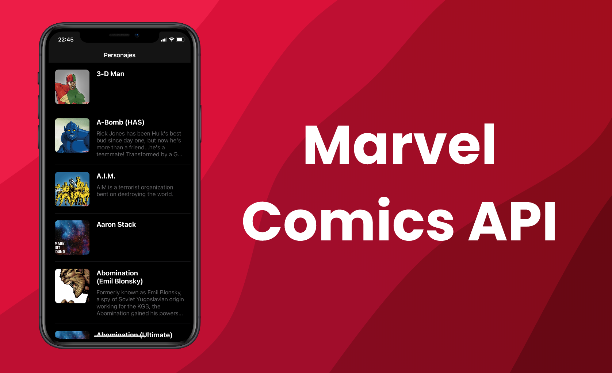

<br>
<p align="center">

</p>
<br>

# Marvel Comics

[](https://img.shields.io/badge/Swift-5.3_5.4_5.5-Orange?style=flat-square) 
[](https://img.shields.io/badge/Platforms-iOS-Green?style=flat-square)

This project based on the Marvel [API](https://developer.marvel.com/docs), lists differents comics with information like:

- List characters
- Detail of character (image, information...)
    - Comics where appear
    - Series where appear
- Information of character
    - Wiki
    - Comic link
    - More details

This app is a simple demo to show the functionality of the API with iOS.

## Important

To use Marvel API you should create an account and generate an API key and configure the file [AppConfig.swift](https://github.com/kevincosta29/marvelcomicios/blob/main/marvelcomicios/Common/AppConfig.swift), changing your created API key.

``` Swift
let PUBLIC_KEY                          : String        = ""
let PRIVATE_KEY                         : String        = ""
```

And the minimum level of iOS VERSION for this app is **13.0**.

## Implemented functionality

1. Using **MVVM** patron to implement the software.
2. Native implemented network with using [KNetwork](https://github.com/kevincosta29/swift-package-network).
3. Animations with [Lottie](https://lottiefiles.com).
4. Dark mode fully operative.

## Screensshots

In the image below can see some screenshots of the application in **Dark** and **Light** mode.


## Demo

Quick demo of the application and the functionality in [YouTube](https://youtu.be/2eCF1Wql9gM).

[](https://youtu.be/2eCF1Wql9gM)

**Copyright © 2021 Kevin Costa. All rights reserved.**
